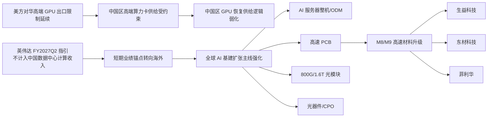
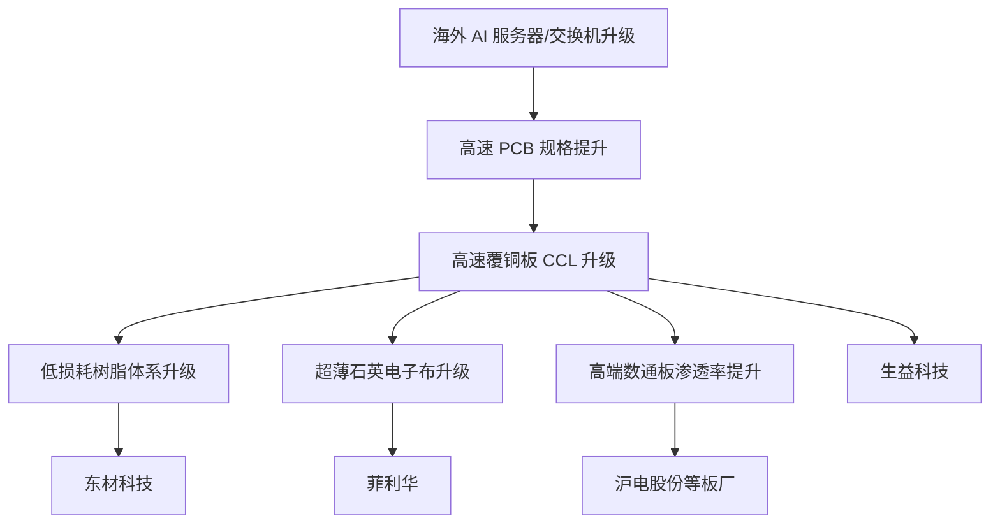
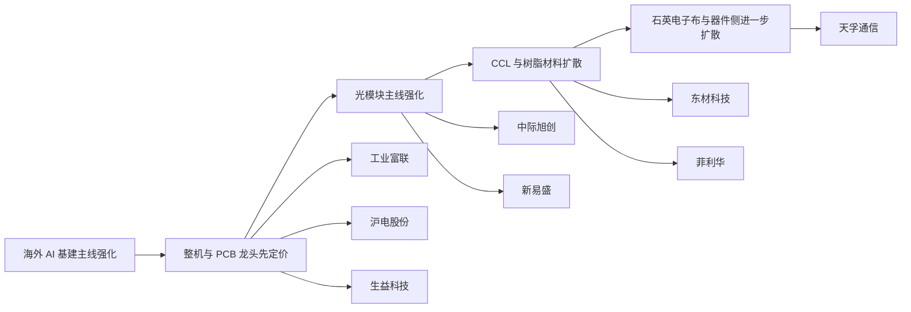

# 国内英伟达产业链供给分析与短期投资方向

> 截至 `2026年5月23日`，国内英伟达产业链的短期投资主线，不在于博弈中国区高端 GPU 恢复供给，而在于寻找英伟达全球 AI 基础设施扩张在 A 股中的确定性映射。

## 一页结论

### 核心判断

当前配置应优先聚焦 `AI 服务器整机/ODM`、`高速 PCB`、`800G/1.6T 光模块`、`光器件/CPO` 以及 `PCB 上游高速材料`。这些环节的共同点是：更依赖海外 AI 基建资本开支和订单兑现，较少依赖中国区高端 GPU 配额变化。

短期不建议把主仓位押在“中国区英伟达高端卡恢复供给”上。原因是 H20 对华出口许可要求仍构成硬约束，且英伟达 FY2027Q2 指引已不假设任何来自中国的数据中心计算收入，市场定价锚点正在转向海外 AI factory 与 hyperscaler 扩产。

### 投资主线优先级

| 优先级 | 主线 | 核心逻辑 | 重点标的 |
| --- | --- | --- | --- |
| 1 | 海外 AI 基建映射 | 全球 AI 服务器、交换网络、光互联持续扩容 | 工业富联、沪电股份、生益科技、中际旭创、新易盛、天孚通信 |
| 2 | Networking 景气扩散 | 英伟达数据中心 networking 高增，带动交换机、PCB、光模块和器件升级 | 沪电股份、中际旭创、天孚通信 |
| 3 | M8/M9 高速材料升级 | 高端数通板向低损耗、高频高速、热稳定材料升级 | 生益科技、东材科技、菲利华 |
| 谨慎 | 中国区 GPU 恢复供给 | 政策变量强，短期确定性不足 | 不作为主押方向 |

### 核心观察名单

| 类型 | 标的 | 交易属性 | 观察重点 |
| --- | --- | --- | --- |
| 中军确定性 | 工业富联 | AI 服务器整机/ODM | GB200/GB300 机柜化、云服务商 AI 服务器订单 |
| 中军确定性 | 沪电股份 | 高速 PCB | AI 服务器、交换机、背板升级与高端数通订单 |
| 材料核心锚 | 生益科技 | 高速 CCL | 高端覆铜板、M8/M9 材料升级、数通板渗透率 |
| 主线高景气 | 中际旭创 | 800G/1.6T 光模块 | 高端光模块交付、海外 AI 集群需求 |
| 主线弹性 | 新易盛 | 800G/1.6T 光模块 | 1.6T DR4、LPO、NPO/XPO 等新方案放量 |
| 扩散方向 | 天孚通信 | 光器件/CPO | 1.6T 光引擎、CPO 配套光器件 |
| 材料高弹性 | 东材科技 | 高速电子树脂 | BMI、活性酯、PPO、碳氢树脂国产替代 |
| 材料特色弹性 | 菲利华 | 超薄石英电子布 | 高频高速 CCL 对低介损基材的需求提升 |

## 逻辑框架

## 投资要点

### 1. 中国区高端 GPU 放量逻辑短期难以成立

上游 GPU 芯片供给仍受出口限制影响，政策不确定性高于产业趋势确定性。凡是过度依赖“中国重新大规模采购英伟达高端卡”的投资逻辑，短期都需要承受较高的不确定性折价。

关键时间点：

| 时间 | 事件 | 对投资判断的影响 |
| --- | --- | --- |
| `2025年4月9日` | H20 对华出口被纳入许可要求 | 中国区高端算力卡供给受约束 |
| `2025年4月14日` | 美方告知该许可要求将无限期生效 | 供给恢复缺少明确时间表 |
| `2026年5月20日` | 英伟达发布 FY2027Q1 财报 | FY2027Q2 指引不假设中国数据中心计算收入 |

### 2. 中游硬件基础设施是更清晰的受益层

英伟达 Blackwell 平台推动整柜、整机、交换与互联体系同步升级，带动的不是单一 GPU 需求，而是整套 AI 基础设施价值量提升。因此，A 股映射深度更强的方向集中在中游硬件和高速互联链条。

| 环节 | 受益机制 | 判断 |
| --- | --- | --- |
| AI 服务器 ODM/整机 | 平台迭代、整柜交付、系统复杂度提升 | 订单兑现较直接 |
| 高速 PCB | 主板、交换机板、背板向高层数和高频高速升级 | 基本面属性较强 |
| 光模块与光器件 | 800G 放量，1.6T 导入，CPO 预期扩散 | 景气度高，弹性强 |
| 网络交换与互联 | AI 集群对带宽、低时延连接要求提高 | 与英伟达 networking 高增同步 |

其中，`PCB` 环节值得单独强调。它并不直接依赖中国区 GPU 配额变化，而是跟随全球 AI 服务器、交换机和高速互联升级同步受益，更接近“订单兑现 + 产能利用率 + 产品结构升级”的基本面逻辑。

### 3. 短期应优选海外 AI 基建映射

从交易胜率看，优先关注能直接向全球 AI 基建设备链条供货、且已有经营数据验证的公司，而不是仅具备概念标签、缺少订单和利润兑现基础的泛题材标的。

## 产业链拆解

### 上游：GPU 对华供给仍受制约

GPU 本体是当前受政策约束最直接的环节。中国区高端产品供给短期看不到高确定性放松，因此国内产业链若只依赖“英伟达卡重新放量”，难以形成稳定投资主线。

### 中游：服务器、PCB、光互联是核心受益层

相较上游芯片，中游硬件基础设施逻辑更顺。GB200/GB300 平台机柜化、超大规模集群建设、交换与布线升级，都会传导到整机、PCB、光模块和光器件环节。

### PCB：高确定性的“卖铲子”方向

PCB 的核心优势在于受益逻辑偏底层基础设施升级，而非单一芯片供给变化。随着 AI 服务器走向高功耗、高密度、高带宽平台，服务器主板、加速卡载板、交换机板卡、背板以及高速连接相关 PCB 的规格持续抬升，推动行业价值量中枢上移。

| 维度 | 变化 | 投资含义 |
| --- | --- | --- |
| 层数提升 | AI 服务器与高端交换机对多层板需求增强 | 高层数产品占比提升 |
| 材料升级 | 高频高速场景要求低损耗、高稳定性材料 | CCL 与树脂体系价值提升 |
| 制程门槛提升 | 孔径、线宽线距、翘曲控制、可靠性验证要求更高 | 龙头厂商更容易受益 |
| 单机价值量提升 | 从普通服务器到 AI 服务器、整柜和高端交换系统 | PCB 用量和价值量同步上行 |

需求侧看，PCB 受益不只来自 AI 服务器主板，也来自交换机、网络板卡和背板同步升级。尤其在 800G 向 1.6T 演进过程中，网络侧高速 PCB 景气度往往不弱于计算侧。

### PCB 上游材料：M8/M9 升级的核心分支

高速 PCB 的价值提升并不只体现在板厂环节，也会体现在 `高速覆铜板(CCL)`、`低损耗树脂体系` 与 `超薄石英电子布` 等材料端升级。市场通常把 `M8/M9` 视作更高等级高速材料体系的代表，其本质是对 `更低介电损耗`、`更高频高速稳定性`、`更强热可靠性` 的综合要求。

| 材料分支 | 产业变化 | 代表标的 |
| --- | --- | --- |
| 高速覆铜板 CCL | 低损耗、低介电常数 CCL 渗透率提升 | 生益科技 |
| 高速电子树脂 | PPO、BMI、碳氢树脂、活性酯树脂重要性上升 | 东材科技 |
| 超薄石英电子布 | 低介损、尺寸稳定性和绝缘性能要求提高 | 菲利华 |

### 下游：海外资本开支是主要需求来源

英伟达当前增长核心驱动力并非中国市场，而是海外云厂商与 AI 基础设施投资者的持续扩产。对 A 股投资者而言，更优选择是寻找“全球 AI 基建受益股”，而不是“国内英伟达代理逻辑股”。

## 重点公司梳理

| 公司 | 所处环节 | 核心看点 | 更适合的交易标签 |
| --- | --- | --- | --- |
| 工业富联 | AI 服务器整机/ODM | 受益于海外云厂商扩产、Blackwell 平台上量、整柜交付价值量提升；`2025年年报`显示云服务商 AI 服务器营收同比增长超过 `3倍`，`800G` 以上高速交换机营收同比增长超过 `13倍` | 偏确定性中军 |
| 沪电股份 | 高端高速 PCB | AI 服务器、高速交换机、背板升级均推升高多层、高频高速 PCB 需求；数据通讯类业务景气度高 | 偏确定性中军 |
| 生益科技 | 高速覆铜板 CCL | 材料平台能力强，受益于高端服务器、交换机和数通板升级带来的高阶 CCL 需求 | 材料端核心锚 |
| 东材科技 | 高速电子树脂 | 双马来酰亚胺树脂、活性酯树脂、碳氢树脂、聚苯醚树脂等配方升级逻辑明确 | 材料端高弹性 |
| 菲利华 | 超薄石英电子布/石英材料 | 超薄石英电子布受益于高频高速 CCL 对低介损和高稳定性基材的需求提升 | 材料端特色弹性 |
| 中际旭创 | 数通光模块 | 全球数通光模块龙头之一，持续推进 `800G/1.6T`、硅光及相干产品布局 | 光模块核心中军 |
| 新易盛 | 数通光模块 | 已推出 `1.6T DR4`、`6.4T NPO`、`12.8T XPO` 等方案，LPO 光模块已规模量产 | 光模块进攻弹性 |
| 天孚通信 | 光器件/光引擎/CPO | 已完成 `1.6T 光引擎`规模量产，并推进 CPO 配套光器件研发 | 光互联扩散方向 |

### PCB 第二梯队与弹性方向

除沪电股份外，PCB 板块中还可关注具备数据通讯、高速板或 AI 相关扩产逻辑的公司。短期交易通常先围绕确定性最强的龙头定价，再向具备产能释放、客户突破或产品升级预期的标的扩散。

这类标的更适合作为板块景气强化后的补充观察对象。其弹性通常高于中军，但对订单验证、盈利兑现和行业景气波动也更敏感。研判 PCB 分支时，建议将 `沪电股份` 作为核心锚，再跟踪其他具备 AI 服务器、高速交换或高端数通 PCB 敞口的公司。

## 短期跟踪框架

### 催化剂

| 催化方向 | 观测指标 | 受益分支 | 优先关注标的 |
| --- | --- | --- | --- |
| 英伟达 networking 持续高增 | 数据中心 networking 收入、交换机订单 | 高速 PCB、光模块、光器件 | 沪电股份、中际旭创、天孚通信 |
| 海外 AI 服务器扩产 | GB200/GB300 出货、整柜交付节奏 | 服务器整机、PCB、CCL | 工业富联、沪电股份、生益科技 |
| 800G 向 1.6T 升级加速 | 1.6T 产品放量、客户验证 | 光模块、光器件、高速材料 | 中际旭创、新易盛、天孚通信 |
| M8/M9 材料逻辑强化 | 高端数通板、低损耗材料认证进展 | CCL、树脂、电子布 | 生益科技、东材科技、菲利华 |

### PCB 分支重点变量

- 海外 AI 服务器和交换机客户订单是否继续上修
- 高多层、高频高速 PCB 产品占比是否持续提升
- 高速覆铜板、电子树脂、石英电子布等材料端认证是否加快
- 龙头厂商产能利用率和产品结构改善是否带来盈利弹性释放
- 市场是否从整机、光模块扩散至“高速互联基础材料与板级环节”

### 不建议作为主押方向的领域

- 博弈中国区高端英伟达 GPU 恢复供货
- 仅具备“英伟达概念”标签、缺少业绩映射的泛题材标的

核心原因在于，前者受政策约束过强，后者更容易在情绪退潮时出现估值回撤。

## 交易节奏

若主线行情继续强化，市场演绎通常遵循以下路径：

1. `中军品种`：工业富联、沪电股份、生益科技
2. `高弹性方向`：中际旭创、新易盛
3. `材料扩散分支`：东材科技、菲利华
4. `景气扩散分支`：天孚通信及其他光器件/CPO 标的

## 风险提示

- 美方出口限制进一步收紧，导致市场对国内英伟达链条预期继续下修
- 海外云厂商资本开支低于预期，影响服务器、光模块和 PCB 需求兑现
- 800G 向 1.6T 切换节奏低于预期，压制高端互联板块估值
- 板块前期涨幅较大后出现高位波动，导致短期交易拥挤

## 结论

当前国内英伟达产业链的短期主线，不在“中国拿到更多英伟达卡”，而在“英伟达继续扩张全球 AI 基建，哪些 A 股公司在卖服务器、PCB、光模块、光器件和高速材料”。

若只保留最核心观察名单，建议优先跟踪：

- 工业富联
- 沪电股份
- 生益科技
- 中际旭创
- 新易盛
- 天孚通信

若补充 `PCB 上游材料` 观察名单，则同步跟踪：

- 东材科技
- 菲利华

其中，`工业富联 + 沪电股份 + 生益科技` 更偏确定性，`中际旭创 + 新易盛 + 天孚通信` 更偏主线弹性，`东材科技 + 菲利华` 更偏材料升级扩散弹性。这一组合更符合当前市场对英伟达产业链从整机、板级到材料端逐步扩散的短期定价逻辑。

## 参考来源

- NVIDIA FY2027 Q1 财报：<https://investor.nvidia.com/news/press-release-details/2026/NVIDIA-Announces-Financial-Results-for-First-Quarter-Fiscal-2027/default.aspx>
- NVIDIA 2025-04-15 8-K：<https://www.sec.gov/Archives/edgar/data/1045810/000104581025000082/nvda-20250409.htm>
- NVIDIA FY2026 10-K：<https://www.sec.gov/Archives/edgar/data/1045810/000104581026000021/nvda-20260125.htm>
- 工业富联 2025 年年报：<https://static.cninfo.com.cn/finalpage/2026-03-11/1225004420.PDF>
- 沪电股份 2024 年报及 2025 年报公开解读：<https://static.cninfo.com.cn/finalpage/2025-03-26/1222896592.PDF>
- 生益科技 2025 年半年度报告：<https://static.cninfo.com.cn/finalpage/2025-08-16/1224499862.PDF>
- 东材科技 2025 年半年度报告：<https://static.cninfo.com.cn/finalpage/2025-08-28/1224598306.PDF>
- 菲利华 2025 年半年度报告：<https://static.cninfo.com.cn/finalpage/2025-08-27/1224576184.PDF>
- 中际旭创公开披露材料：<https://static.cninfo.com.cn/finalpage/2025-04-21/1223155502.PDF>
