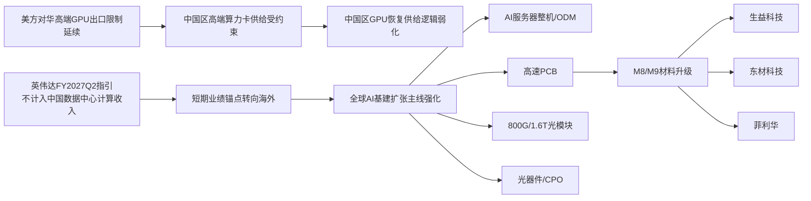
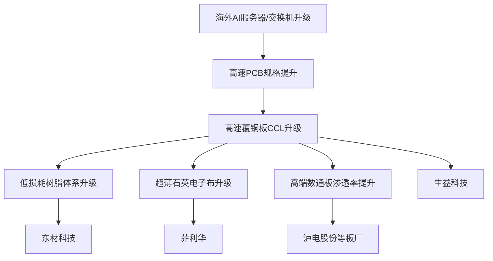
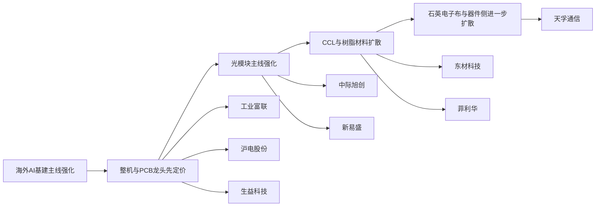

# 国内英伟达产业链供给分析与短期投资方向

## 核心观点

我们认为，截至 `2026年5月23日`，国内英伟达产业链的短期投资主线并不在于博弈中国区高端 GPU 恢复供给，而在于把握英伟达全球 AI 基础设施扩张所对应的 A 股映射机会。配置方向上，建议优先聚焦 `AI 服务器整机/ODM`、`高速 PCB`、`800G/1.6T 光模块` 以及 `光器件/CPO` 等具备订单兑现能力和业绩支撑的环节。

核心逻辑在于两点。其一，`2025年4月9日` 起 H20 对华出口被纳入许可要求，且 `2025年4月14日` 美方进一步告知该要求将无限期生效，中国区高端算力卡供给仍处于严格约束状态。其二，英伟达于 `2026年5月20日` 发布 FY2027Q1 财报时明确表示，FY2027Q2 指引不假设任何来自中国的数据中心计算收入，这意味着短期业绩展望本身已不再依赖中国市场恢复。

基于上述判断，市场更值得交易的主线仍然是全球 AI 资本开支扩张，尤其是海外 hyperscaler 与 AI factory 持续扩容背景下，对服务器系统、交换网络、光互联和高端 PCB 的需求提升。

## 核心结论图

## 核心标的速览

| 方向           | 核心逻辑                        | 代表标的     | 短期判断    |
| ------------ | --------------------------- | -------- | ------- |
| AI 服务器整机/ODM | 受益于 GB200/GB300 机柜化、整机价值量提升 | 工业富联     | 偏确定性中军  |
| 高速 PCB       | 受益于高多层、高频高速、背板升级            | 沪电股份     | 偏确定性中军  |
| 高速覆铜板(CCL)   | 受益于 M8/M9 等材料升级与高端数通渗透      | 生益科技     | 材料端核心锚  |
| 高速电子树脂       | 受益于 CCL 配方体系升级与国产替代         | 东材科技     | 材料端高弹性  |
| 超薄石英电子布      | 受益于更高等级高速基材升级               | 菲利华      | 材料端特色弹性 |
| 光模块          | 受益于 800G 放量与 1.6T 导入        | 中际旭创、新易盛 | 主线高景气   |
| 光器件/CPO      | 受益于光引擎与上游器件升级               | 天孚通信     | 主线扩散方向  |

## 投资要点

### 第一，国内直接受益于中国区英伟达 GPU 放量的逻辑短期难以成立

当前上游 GPU 芯片供给仍受出口限制影响，政策不确定性远高于产业趋势确定性。对于 A 股而言，凡是过度依赖“中国重新大规模采购英伟达高端卡”的投资逻辑，短期都面临较强的不确定性折价。

### 第二，产业链中游硬件环节仍是最清晰的受益方向

英伟达 Blackwell 平台推动整柜、整机、交换与互联体系同步升级，带动的不是单一 GPU 需求，而是整套 AI 基础设施价值量提升。因此，真正具备映射深度的方向，更多集中在以下几类：

- `AI 服务器 ODM/整机`：受益于平台迭代、机柜价值量抬升以及系统复杂度增加。
- `高速 PCB`：AI 服务器主板、交换机板、背板对高层数、高频高速和高可靠性的需求持续提升。
- `光模块与光器件`：800G 仍在放量区间，1.6T 正处于导入与加速渗透阶段。
- `网络交换与互联`：英伟达数据中心 networking 业务高增，反映算力集群对带宽和低时延连接需求显著增强。

其中，`PCB` 环节值得单独强调。原因在于其并不直接依赖中国区 GPU 配额变化，而是跟随全球 AI 服务器、交换机和高速互联升级同步受益，具备更强的景气独立性。相较纯主题映射，PCB 更接近“订单和产能兑现驱动”的基本面逻辑，是当前英伟达产业链中兼具确定性与机构配置属性的重要方向。

### 第三，短期优选“海外 AI 基建映射”，而非泛英伟达概念扩散

从交易胜率看，建议优先关注能直接向全球 AI 基建设备链条供货、且已有经营数据验证的公司，而不是仅具备概念属性、缺少订单与利润兑现基础的题材标的。

## 产业链拆解

### 上游：GPU 对华供给仍受制约

GPU 本体仍是当前受政策约束最直接的环节，中国区高端产品供给短期看不到高确定性放松。由此带来的结论是，国内产业链若仅依赖“英伟达卡重新放量”，则短期难以形成稳定投资主线。

### 中游：服务器、PCB、光互联是核心受益层

相较上游芯片，中游硬件基础设施的逻辑更顺。无论是 GB200/GB300 平台的机柜化趋势，还是超大规模集群建设对交换、布线、互联的要求提升，最终都会传导到整机、PCB、光模块与光器件环节。这也是当前 A 股中最具确定性的英伟达映射方向。

### PCB：高确定性的“卖铲子”方向

在整个英伟达产业链映射中，PCB 的核心优势在于其受益逻辑更偏底层基础设施升级，而非单一芯片供给变化。随着 AI 服务器从传统架构走向高功耗、高密度、高带宽平台，服务器主板、加速卡载板、交换机板卡、背板以及高速连接相关 PCB 的规格持续抬升，推动行业价值量中枢上移。

从技术趋势看，PCB 受益主要体现在以下几个维度：

- `层数提升`：AI 服务器与高端交换机对多层板需求更强，高层数产品占比提升。
- `材料升级`：高频高速场景下，对低损耗材料、信号完整性和热稳定性的要求显著提高。
- `良率与制程门槛提升`：高端产品对孔径、线宽线距、翘曲控制和可靠性验证要求更高，龙头厂商更容易受益。
- `单机价值量提升`：从普通服务器到 AI 服务器，再到整柜和高端交换系统，单机对应 PCB 用量和价值量均显著上行。

从需求结构看，PCB 受益并不只来自 AI 服务器主板本身，更来自交换机、网络板卡和背板的同步升级。尤其在 800G 向 1.6T 演进过程中，网络侧高速 PCB 的景气度往往不弱于计算侧。换言之，市场如果继续交易“英伟达 networking 高增长”，PCB 将是重要的同步受益方向。

从投资方法上看，PCB 板块更适合用“业绩兑现 + 产能利用率提升 + 产品结构升级”框架来跟踪，而不宜仅按题材映射理解。真正值得重视的是那些已经切入高端数据通讯、AI 服务器或高速交换机供应链，并且具备持续扩产和客户验证能力的企业。

### PCB 上游材料：M8/M9 升级背后的核心受益环节

若进一步往上游拆解，当前高速 PCB 的价值提升并不只体现在板厂环节，更体现在 `高速覆铜板(CCL)`、`低损耗树脂体系` 与 `超薄石英电子布` 等材料端升级。这里需要强调的是，市场通常把 `M8/M9` 视作更高等级高速材料体系的代表，其本质并不是单一题材名词，而是对 `更低介电损耗`、`更高频高速稳定性`、`更强热可靠性` 的综合要求。基于公司公开披露材料，这一判断更接近产业趋势推演，而非单一公司口径的直接表述。

从产业逻辑看，AI 服务器、800G/1.6T 交换机以及更高带宽背板持续升级后，高速 PCB 对材料端的要求显著提高，核心变化主要集中在以下几个层面：

- `覆铜板升级`：高频高速场景推动低损耗、低介电常数 CCL 渗透率提升。
- `树脂体系升级`：PPO、BMI、碳氢树脂、活性酯树脂等高速电子树脂的重要性上升。
- `电子布升级`：更低介损、尺寸稳定性更强的超薄石英电子布，成为高端高速 CCL 的关键基材之一。
- `国产替代加速`：材料认证周期长、壁垒高，一旦切入高端数通链条，盈利弹性通常强于普通周期品。

因此，若市场继续从 `高速 PCB 制造` 向 `材料平台型公司` 扩散，真正值得重视的并非泛材料概念，而是那些已经在高端 CCL、电子树脂、石英电子布等环节形成产品卡位、并受益于 AI 数通升级的企业。

### PCB 材料端价值链图

### PCB 上游材料端重点公司比较

| 公司   | 所处环节         | 研报定位    | 核心看点                      | 更适合的交易标签 |
| ---- | ------------ | ------- | ------------------------- | -------- |
| 生益科技 | 高速覆铜板(CCL)   | 材料端核心中军 | 平台型能力强，受益于高端数通板与 AI 服务器升级 | 确定性      |
| 东材科技 | 高速电子树脂       | 材料端高弹性  | BMI、活性酯、PPO、碳氢树脂等配方升级逻辑明确 | 弹性       |
| 菲利华  | 超薄石英电子布/石英材料 | 材料端特色品种 | 对更低介损和更高稳定性要求提升更敏感        | 扩散弹性     |

### 下游：海外资本开支仍是主要需求来源

英伟达当前增长核心驱动力并非中国市场，而是海外云厂商与 AI 基础设施投资者的持续扩产。对于 A 股投资者而言，更优选择是寻找“全球 AI 基建受益股”，而不是“国内英伟达代理逻辑股”。

## 重点公司梳理

### 工业富联

工业富联是当前 A 股中英伟达 AI 服务器整机链条最直接的映射标的之一。公司核心受益于海外云厂商扩产、Blackwell 平台上量以及整柜交付价值量提升。根据公司 `2025年年报`，云服务商 AI 服务器营收同比增长超过 `3倍`，`800G` 以上高速交换机营收同比增长超过 `13倍`，业绩验证力度较强。

从交易角度看，若市场继续围绕 GB200/GB300 机柜放量展开定价，工业富联通常具备更高的机构关注度与定价优先级，适合作为偏确定性的中军标的。

### 沪电股份

沪电股份是高端高速 PCB 环节的核心代表。AI 服务器、高速交换机以及背板升级，均对高多层、高频高速 PCB 提出更高要求，公司所处赛道具备典型“卖铲子”属性。`2025年报`披露的公开信息显示，AI 服务器和高速网络交换机需求明显增长，数据通讯类业务景气度维持高位。

从风格上看，PCB 板块通常兼具基本面与机构配置属性。当市场从主题交易回归业绩定价时，沪电股份往往具备更强的防御性和持续性。

### PCB 第二梯队与弹性方向

除沪电股份外，PCB 板块中还可关注具备数据通讯、高速板或 AI 相关扩产逻辑的公司。若从短期交易视角出发，市场通常会先围绕确定性最强的龙头定价，再向具备产能释放、客户突破或产品升级预期的标的扩散。

这一层标的更适合作为板块景气强化后的补充观察对象，其定价弹性通常高于中军，但同时对订单验证、盈利兑现和行业景气波动也更为敏感。因此在研判 PCB 分支时，建议将 `沪电股份` 作为核心锚，再跟踪其他具备 AI 服务器、高速交换或高端数通 PCB 敞口的公司。

### 生益科技

若把视角从板厂延伸到材料端，生益科技是当前 A 股 `高速覆铜板` 环节最核心的锚之一。根据公司 `2025年半年度报告`，公司 `2025年上半年` 覆铜板与粘结片销量继续增长，同时明确表示把握住 AI 时代的新一轮产业机会。对于英伟达产业链映射而言，生益科技的重要性在于其更偏底层材料平台，受益逻辑并非单一客户映射，而是高端服务器、交换机、数通板整体升级所带来的高阶 CCL 需求抬升。

从交易框架看，若市场开始强化 `M8/M9 等高速材料升级` 逻辑，生益科技通常会被视作材料端最具辨识度的核心中军之一。其优势在于产业地位高、产品线完整、业绩口径更偏基本面验证。

### 东材科技

东材科技的看点在于 `高速电子树脂` 平台布局。根据公司 `2025年半年度报告`，公司披露的高速电子树脂产品包括 `双马来酰亚胺树脂`、`活性酯树脂`、`碳氢树脂`、`聚苯醚树脂` 等，并明确提到受益于人工智能与算力升级等新兴领域发展。对于 PCB 上游材料链而言，东材科技更接近“CCL 配方体系升级”的受益方向，其弹性通常大于成熟板材龙头，但也更依赖产品认证、客户导入和结构改善节奏。

若后续市场从 `板厂景气` 向 `配方材料国产替代` 扩散，东材科技通常是值得重点跟踪的弹性标的之一。它更适合放在 `高速材料升级` 分支，而不是简单归类为传统化工股。

### 菲利华

菲利华的补充意义在于 `超薄石英电子布` 与高性能石英材料。根据公司 `2025年半年度报告`，公司明确披露“超薄石英电子布是应用于高频高速覆铜板(CCL)的优选材料”。这意味着若市场进一步交易高阶高速材料体系，菲利华并非直接受益于 PCB 制造放量，而是受益于 `更高等级高速基材` 对低介损、尺寸稳定性与绝缘性能提出的更高要求。

从标的属性看，菲利华更偏材料升级链中的特色品种，其逻辑强度取决于市场是否从 `板级扩产` 进一步深入到 `关键基材升级`。若资金开始交易 `M9 材料` 或更高端电子布路线，菲利华的辨识度会明显提升。

### 中际旭创

中际旭创是全球数通光模块龙头之一，也是海外 AI 集群建设背景下最核心的光模块受益标的之一。公司持续推进 `800G/1.6T`、硅光及相干产品布局，高端产品交付仍是 `2026年`的重要主线。

若后续市场进一步强化“AI 网络带宽瓶颈”逻辑，中际旭创通常是光模块主线中的核心中军。其优势在于产业地位高、产品迭代路径清晰、受益逻辑直接。

### 新易盛

新易盛的特点在于弹性更强，适合对应 800G 向 1.6T 升级过程中的进攻型配置。根据 `2025年报` 及 `2026Q1` 公开资料，公司已推出 `1.6T DR4`、`6.4T NPO`、`12.8T XPO` 等方案，线性可插拔 LPO 光模块亦已实现规模量产。

相较中际旭创，新易盛更偏向高成长与前沿技术路线布局，市场在风险偏好提升阶段，通常更容易给予其更高弹性溢价。

### 天孚通信

天孚通信是光器件、光引擎及 CPO 配套方向的关键标的。公司在上游器件侧具备较强卡位能力，根据 `2025年报` 相关公开信息，公司已完成 `1.6T 光引擎`规模量产，并推进 CPO 配套光器件研发。

若市场由整机、PCB、模块进一步向上游器件扩散，天孚通信通常会成为光互联上游方向最具辨识度的代表之一，更适合作为主线扩散阶段的配置对象。

## 短期投资方向判断

### 优先级一：海外 AI 基建主线

短期配置建议优先聚焦以下标的：

- 工业富联
- 沪电股份
- 生益科技
- 中际旭创
- 新易盛
- 天孚通信

这一方向的优势在于同时具备 `产业趋势强`、`订单兑现快`、`政策扰动相对较小` 三重特征，是当前英伟达产业链中最值得重视的 A 股映射主线。

### 优先级二：围绕 networking 的景气扩散

英伟达 FY2027Q1 财报中，数据中心 networking 收入同比增长 `199%`，显著高于一般市场预期。这表明市场正在从“买 GPU”走向“买整套 AI 集群基础设施”，即 GPU、交换、光互联与机柜系统一体化升级。

据此，短期建议重点跟踪以下几个催化变量：

- 800G 光模块需求是否持续超预期
- 1.6T 放量节奏是否提前
- 交换机、高速 PCB 的新增订单与扩产信号

若进一步细分到 PCB 板块，短期可重点跟踪以下边际变化：

- 海外 AI 服务器和交换机客户订单是否继续上修
- 高多层、高频高速 PCB 产品占比是否持续提升
- 高速覆铜板、电子树脂、石英电子布等材料端认证是否加快
- 龙头厂商产能利用率和产品结构改善是否带来盈利弹性释放
- 市场是否从整机、光模块扩散至“高速互联基础材料与板级环节”

### 重点催化剂图表

| 催化方向                | 观测指标                     | 受益分支           | 优先关注标的         |
| ------------------- | ------------------------ | -------------- | -------------- |
| 英伟达 networking 持续高增 | 数据中心 networking 收入、交换机订单 | 高速 PCB、光模块、光器件 | 沪电股份、中际旭创、天孚通信 |
| 海外 AI 服务器扩产         | GB200/GB300 出货、整柜交付节奏    | 服务器整机、PCB、CCL  | 工业富联、沪电股份、生益科技 |
| 800G 向 1.6T 升级加速    | 1.6T 产品放量、客户验证           | 光模块、光器件、高速材料   | 中际旭创、新易盛、天孚通信  |
| M8/M9 材料逻辑强化        | 高端数通板、低损耗材料认证进展          | CCL、树脂、电子布     | 生益科技、东材科技、菲利华  |

### 不建议作为主押方向的领域

以下方向短期不建议作为核心仓位重点：

- 博弈中国区高端英伟达 GPU 恢复供货
- 仅具备“英伟达概念”标签、缺少业绩映射的泛题材标的

核心原因在于，前者受政策约束过强，后者则更容易在情绪退潮时出现估值回撤。

## 交易节奏理解

若从短期交易路径看，市场演绎通常遵循以下顺序：

1. `中军品种`：工业富联、沪电股份、生益科技
2. `高弹性方向`：中际旭创、新易盛
3. `材料扩散分支`：东材科技、菲利华
4. `景气扩散分支`：天孚通信及其他光器件/CPO 标的

也就是说，若主线行情继续强化，通常先表现为整机、PCB 与 CCL 龙头的机构定价，再向光模块强化，随后扩散至高速材料与上游器件分支。

## 交易路径示意

## 风险提示

- 美方出口限制进一步收紧，导致市场对国内英伟达链条预期继续下修
- 海外云厂商资本开支低于预期，影响服务器、光模块和 PCB 需求兑现
- 800G 向 1.6T 切换节奏低于预期，压制高端互联板块估值
- 板块前期涨幅较大后出现高位波动，导致短期交易拥挤

## 结论

综合来看，当前国内英伟达产业链的短期主线，不在“中国拿到更多英伟达卡”，而在“英伟达继续扩张全球 AI 基建，哪些 A 股公司在卖服务器、PCB、光模块和光器件”。

若只保留最核心的观察名单，建议优先跟踪：

- 工业富联
- 沪电股份
- 生益科技
- 中际旭创
- 新易盛
- 天孚通信

若进一步补充 `PCB 上游材料` 观察名单，则建议同步跟踪：

- 东材科技
- 菲利华

其中，`工业富联 + 沪电股份 + 生益科技` 更偏确定性，`中际旭创 + 新易盛 + 天孚通信` 更偏主线弹性，`东材科技 + 菲利华` 更偏材料升级扩散弹性。这一组合更符合当前市场对英伟达产业链从整机、板级到材料端逐步扩散的短期定价逻辑。

## 参考来源

- NVIDIA FY2027 Q1 财报：<https://investor.nvidia.com/news/press-release-details/2026/NVIDIA-Announces-Financial-Results-for-First-Quarter-Fiscal-2027/default.aspx>
- NVIDIA 2025-04-15 8-K：<https://www.sec.gov/Archives/edgar/data/1045810/000104581025000082/nvda-20250409.htm>
- NVIDIA FY2026 10-K：<https://www.sec.gov/Archives/edgar/data/1045810/000104581026000021/nvda-20260125.htm>
- 工业富联 2025 年年报：<https://static.cninfo.com.cn/finalpage/2026-03-11/1225004420.PDF>
- 沪电股份 2024 年报及 2025 年报公开解读：<https://static.cninfo.com.cn/finalpage/2025-03-26/1222896592.PDF>
- 生益科技 2025 年半年度报告：<https://static.cninfo.com.cn/finalpage/2025-08-16/1224499862.PDF>
- 东材科技 2025 年半年度报告：<https://static.cninfo.com.cn/finalpage/2025-08-28/1224598306.PDF>
- 菲利华 2025 年半年度报告：<https://static.cninfo.com.cn/finalpage/2025-08-27/1224576184.PDF>
- 中际旭创公开披露材料：<https://static.cninfo.com.cn/finalpage/2025-04-21/1223155502.PDF>
